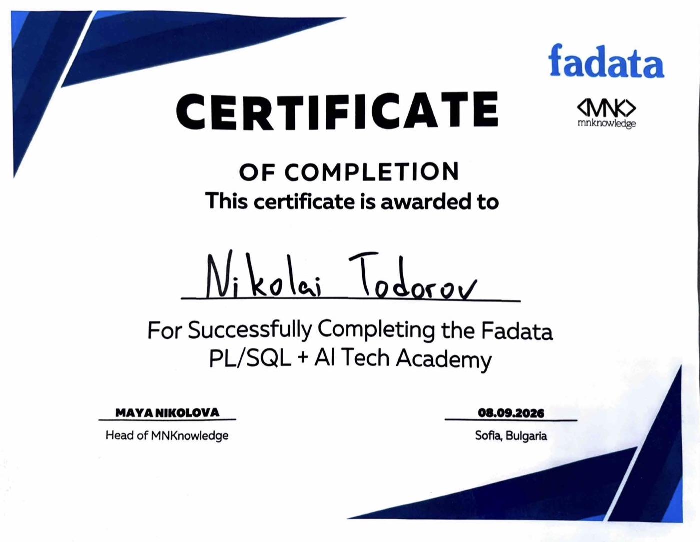

<div align="center">


<br/>

[](https://wavsy.dev)


</div>

## `> whoami`

```csharp
public class Nikolai : Developer
{
    public string Location  => "Sofia · Kazanlak, Bulgaria 🇧🇬";
    public string Company   => "Wavsy — web studio I co-founded (wavsy.dev)";
    public string Building  => "TodorovNET — live timing for hard enduro 🏍️";

    public string[] Backend  => ["C#", ".NET", "ASP.NET Core", "SignalR", "EF Core"];
    public string[] Frontend => ["Next.js", "React", "TypeScript", "Tailwind"];
    public string[] Data     => ["MS SQL", "PostgreSQL", "Oracle PL/SQL", "Supabase"];
    public string[] AI       => ["AI assistants", "AI agents", "Automations"];

    public string Latest => "Fadata PL/SQL + AI Tech Academy — completed 🏅";

    public string Motto => "Ship it, measure it, make it faster.";
}
```

## 🛠️ Tech stack

<div align="center">


<br/>

<br/>


<br/><br/>


</div>

## 🚀 Featured projects

<table>
<tr>
<td width="50%" valign="top">

### 🏁 [TodorovNET](https://github.com/Narcoswiu/TodorovNet)
<a href="https://todorovnet.vercel.app"></a>

Live timing, penalties and championship standings for **hard enduro** races — results update on screen while riders are still on track. Officials get a phone app that records times even without coverage.

**[🔴 Live →](https://todorovnet.vercel.app)**


</td>
<td width="50%" valign="top">

### ⏱️ [TodorovNET.API](https://github.com/Narcoswiu/TodorovNet1)
The original race-timing backend: REST API with JWT auth and a **real-time leaderboard** pushed over SignalR.


</td>
</tr>
</table>

## 🌊 Wavsy — my web studio

<div align="center">

<a href="https://wavsy.dev">
<picture>
  <source media="(prefers-color-scheme: dark)" srcset="https://raw.githubusercontent.com/wavsy/wavsy/main/public/brand/wavsy-logo-horizontal-white.svg" />
  
</picture>
</a>

**Websites that bring clients, not just look good.**
I co-founded Wavsy to build fast, modern sites for local businesses — from Kazanlak to Germany and Mexico.


<a href="https://wavsy.dev"></a>

<br/>

<table>
<tr>
<td align="center" width="33%">
<a href="https://stormcarwash.vercel.app/"></a>
<br/><b><a href="https://stormcarwash.vercel.app/">Storm Car Wash</a></b><br/>
<sub>Car wash · Kazanlak</sub>
</td>
<td align="center" width="33%">
<a href="https://kibo-2.vercel.app/"></a>
<br/><b><a href="https://kibo-2.vercel.app/">KIBO - 2</a></b><br/>
<sub>Plumbing & heating · Kazanlak</sub>
</td>
<td align="center" width="33%">
<a href="https://www.glenz-reinigung.com/"></a>
<br/><b><a href="https://www.glenz-reinigung.com/">Glenz Reinigung</a></b><br/>
<sub>Cleaning · Germany</sub>
</td>
</tr>
<tr>
<td align="center" width="33%">
<a href="https://manufacturas-quezher.vercel.app/"></a>
<br/><b><a href="https://manufacturas-quezher.vercel.app/">Manufacturas Quezher</a></b><br/>
<sub>Metalworking · Mexico</sub>
</td>
<td align="center" width="33%">
<a href="https://cacao-cartel.vercel.app/"></a>
<br/><b><a href="https://cacao-cartel.vercel.app/">Cacao Cartel</a></b><br/>
<sub>Concept · 3D & scroll effects</sub>
</td>
<td align="center" width="33%">
<a href="https://todorovnet.vercel.app/"></a>
<br/><b><a href="https://todorovnet.vercel.app/">TodorovNET</a></b><br/>
<sub>Our own product</sub>
</td>
</tr>
</table>

[](https://wavsy.dev)

</div>

## 🤖 AI systems — assistants, agents & automations

<div align="center">

**Not off-the-shelf bots.** Systems built around how a business actually works —
its customers, its rules and the software it already uses.

</div>

<table>
<tr>
<td width="50%" align="center" valign="middle">



</td>
<td width="50%" valign="top">

### 💬 AI assistant
Answers customers **24/7, in their language**. Knows the services, prices and policies — and hands the chat to a person when it doesn't know.
<br/><sub>Website · WhatsApp · Viber · 🇧🇬 🇬🇧 🇩🇪</sub>

### 🦾 AI agent
Doesn't just answer — **it acts**: books appointments, drafts quotes, checks availability, right inside the tools already in use.
<br/><sub>A person approves what matters</sub>

### ⚡ Automation
Takes over the routine between systems: **enquiry → CRM in seconds**, reports that write themselves, alerts when something needs attention.

</td>
</tr>
</table>

<div align="center">

**🔌 Integrates with**

         

<br/>

| ⏰ 24/7 | 🌍 3 languages | 🧪 2–4 week pilot | 🧑‍💼 Human in the loop |
|:---:|:---:|:---:|:---:|
| answers customers, weekends included | Bulgarian, English, German | real results before you decide | every important action goes through a person |

**🟢 Live now:** the chat assistant on **[KIBO - 2](https://kibo-2.vercel.app/)** points visitors to the right service.

[](https://wavsy.dev/en/ai)

</div>

## 📈 Activity

<div align="center">

<picture>
  <source media="(prefers-color-scheme: dark)" srcset="https://raw.githubusercontent.com/Narcoswiu/Narcoswiu/output/profile-night-rainbow.svg" />
  
</picture>


<picture>
  <source media="(prefers-color-scheme: dark)" srcset="https://raw.githubusercontent.com/Narcoswiu/Narcoswiu/output/github-snake-dark.svg" />
  
</picture>

</div>

## 🎓 Education

### 🏅 Fadata — PL/SQL + AI Tech Academy

<table>
<tr>
<td width="55%" align="center">
<a href="assets/fadata-certificate.jpg"></a>
<br/><sub>Click to view full size</sub>
</td>
<td width="45%" valign="middle">


**Certificate of Completion**

🏢 &nbsp;**Fadata** × **MNKnowledge**
<br/>📍 &nbsp;Sofia, Bulgaria
<br/>🗓️ &nbsp;8 September 2026

Academy by Fadata, a software company building core systems for the insurance industry. Focused on **Oracle PL/SQL** for enterprise back-ends and on applying **AI** in real-world development.

</td>
</tr>
</table>


### 🏆 SoftUni — a perfect record

<div align="center">


<sub>Click any card to see the official certificate</sub>

<table>
<tr>
<td align="center" width="25%">
<a href="https://softuni.bg/Certificates/Details/172518/27c9b1f4"></a>
<br/><sub>#1</sub><br/>
<b>Programming Basics</b><br/>
<sub>🗓️ Apr 2023</sub><br/><br/>
<a href="https://softuni.bg/Certificates/Details/172518/27c9b1f4"></a>
</td>
<td align="center" width="25%">
<a href="https://softuni.bg/Certificates/Details/194798/35e8bb78"></a>
<br/><sub>#2</sub><br/>
<b>Programming Fundamentals</b><br/>
<sub>🗓️ Sep 2023</sub><br/><br/>
<a href="https://softuni.bg/Certificates/Details/194798/35e8bb78"></a>
</td>
<td align="center" width="25%">
<a href="https://softuni.bg/Certificates/Details/203554/c1299948"></a>
<br/><sub>#3</sub><br/>
<b>C# Advanced</b><br/>
<sub>🗓️ Jan 2024</sub><br/><br/>
<a href="https://softuni.bg/Certificates/Details/203554/c1299948"></a>
</td>
<td align="center" width="25%">
<a href="https://softuni.bg/Certificates/Details/211224/76200d7e"></a>
<br/><sub>#4</sub><br/>
<b>C# OOP</b><br/>
<sub>🗓️ Feb 2024</sub><br/><br/>
<a href="https://softuni.bg/Certificates/Details/211224/76200d7e"></a>
</td>
</tr>
<tr>
<td align="center" width="25%">
<a href="https://softuni.bg/Certificates/Details/228582/9cbfdd43"></a>
<br/><sub>#5</sub><br/>
<b>HTML & CSS</b><br/>
<sub>🗓️ Sep 2024</sub><br/><br/>
<a href="https://softuni.bg/Certificates/Details/228582/9cbfdd43"></a>
</td>
<td align="center" width="25%">
<a href="https://softuni.bg/Certificates/Details/232322/73946ae"></a>
<br/><sub>#6</sub><br/>
<b>JS Front-End</b><br/>
<sub>🗓️ Oct 2024</sub><br/><br/>
<a href="https://softuni.bg/Certificates/Details/232322/73946ae"></a>
</td>
<td align="center" width="25%">
<a href="https://softuni.bg/Certificates/Details/235765/f27c9674"></a>
<br/><sub>#7</sub><br/>
<b>MS SQL</b><br/>
<sub>🗓️ Jan 2025</sub><br/><br/>
<a href="https://softuni.bg/Certificates/Details/235765/f27c9674"></a>
</td>
<td align="center" width="25%">
<a href="https://softuni.bg/Certificates/Details/239803/968bac11"></a>
<br/><sub>#8</sub><br/>
<b>Entity Framework Core</b><br/>
<sub>🗓️ Feb 2025</sub><br/><br/>
<a href="https://softuni.bg/Certificates/Details/239803/968bac11"></a>
</td>
</tr>
</table>

</div>

### 🎓 IT-Kariera — Software Engineering

<div align="center">


<sub>From first line of code to databases, algorithms and systems</sub>


<table>
<tr>
<td align="center" width="25%">
<h2>🌱</h2>
<sub>MODULE 01</sub><br/>
<b>Introduction to Programming</b><br/>
<sub>✅ Completed</sub>
</td>
<td align="center" width="25%">
<h2>💻</h2>
<sub>MODULE 02</sub><br/>
<b>Programming</b><br/>
<sub>✅ Completed</sub>
</td>
<td align="center" width="25%">
<h2>🧩</h2>
<sub>MODULE 03</sub><br/>
<b>Intro to OOP</b><br/>
<sub>✅ Completed</sub>
</td>
<td align="center" width="25%">
<h2>🧮</h2>
<sub>MODULE 04</sub><br/>
<b>Algorithms & Data Structures</b><br/>
<sub>✅ Completed</sub>
</td>
</tr>
<tr>
<td align="center" width="25%">
<h2>🏛️</h2>
<sub>MODULE 05</sub><br/>
<b>Object-Oriented Programming</b><br/>
<sub>✅ Completed</sub>
</td>
<td align="center" width="25%">
<h2>🗄️</h2>
<sub>MODULE 06</sub><br/>
<b>Databases</b><br/>
<sub>✅ Completed</sub>
</td>
<td align="center" width="25%">
<h2>🛠️</h2>
<sub>MODULE 07</sub><br/>
<b>Software Development</b><br/>
<sub>✅ Completed</sub>
</td>
<td align="center" width="25%">
<h2>⚙️</h2>
<sub>MODULE 08</sub><br/>
<b>Operating & Embedded Systems</b><br/>
<sub>✅ Completed</sub>
</td>
</tr>
</table>

</div>

<div align="center">

<br/>


<br/><br/>

**Have a project in mind?** Let's build it → **[wavsy.dev](https://wavsy.dev)**


</div>
